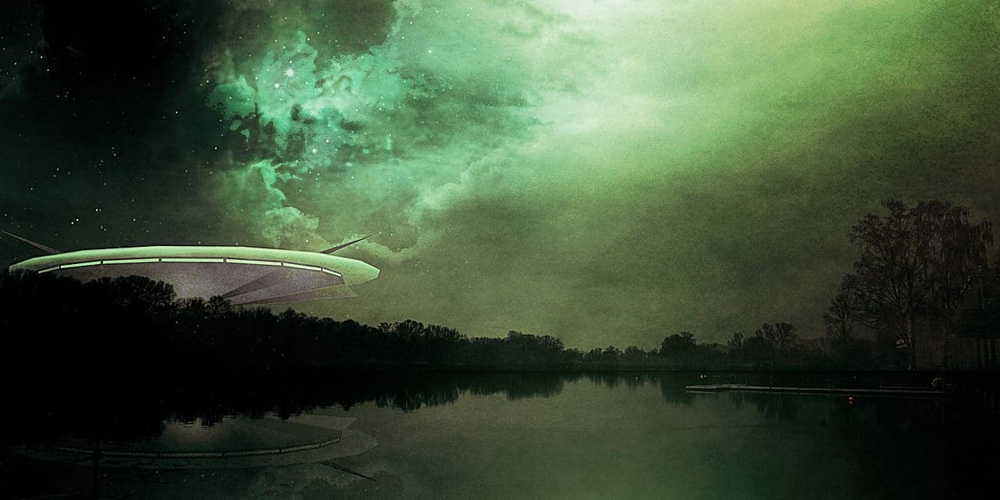

# UFO_Sightings_JS_R

https://ktung2018.github.io/UFO_Sightings_JS/

- Use of JavaScript, HTML, CSS and DOM Manipulation to create a dynamic table of UFO Sightings based upon data provided via [data.js](data.js)
- The program allows user to search through the table for specific information using mutltiple search categories.
- Use of R for data manupilation

